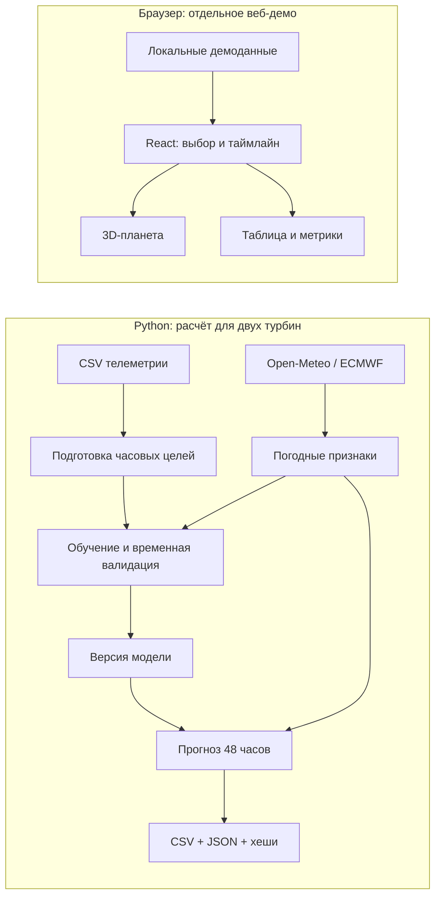

# OnlyFriends — прогноз мощности ветроэлектростанции

**Почасовой прогноз на 24–48 часов и интерактивная 3D-демонстрация ветропарка.**

Проект разработан для кейса HackAlemAI «Agentic AI для прогнозирования выработки ВЭС» от Самрук-Қазына. Он предназначен для операторов и аналитиков ветроэлектростанций: помогает оценивать ожидаемую мощность по прогнозу погоды, сравнивать модели на исторических данных и проверять происхождение каждого расчёта.

**Текущая версия состоит из двух самостоятельных частей.** Python-конвейер строит численный прогноз для двух турбин из данных организаторов. Веб-интерфейс показывает шесть демонстрационных турбин и пока не подключён к этому конвейеру.

| | Python / ML | Веб-интерфейс |
| --- | --- | --- |
| Турбины | 2 из исходных CSV | 6 условных объектов |
| Данные | Историческая телеметрия и архивные прогнозы ECMWF | Локально генерируемые демонстрационные значения |
| Результат | Нормализованная мощность, CSV и JSON-журналы | 3D-сцена, таблица, метрики и таймлайн |
| Запуск | Команды CLI | React-приложение в браузере |

## Что реализовано

### Прогнозирование и анализ

- Загрузка десятиминутной телеметрии, проверка колонок, временных меток и допустимых значений; расчёт почасовых целей.
- Получение отдельных архивных выпусков ECMWF IFS через Open-Meteo, проверка полноты 48-часового горизонта и локальный кэш.
- Обучение CatBoost, базовой кривой мощности и других кандидатов; последовательная проверка на будущих относительно обучения месяцах.
- Прогноз одного выпуска: **48 часов × 2 турбины = 96 строк**, плюс 48 значений суммы по станции.
- Ретропрогноз с 31 января по 28 февраля 2026 года: 29 ежедневных выпусков и итоговый файл с последним допустимым прогнозом на каждый час февраля.
- Версии моделей, хеши входных данных и погодных выпусков, журнал успешных и неуспешных запусков.
- Отдельный ограниченный граф `ForecastAgent` на LangGraph с проверками, анализом результата и необязательной трассировкой LangSmith.
- Воспроизводимые эксперименты: сравнение девяти семейств моделей, отдельных моделей турбин и дополнительных конфигураций CatBoost.

### Веб-демо

- Процедурная 3D-планета с турбинами, деревьями и облаками; вращение, инерция, масштабирование колесом/жестом и кнопками 1×–5×.
- Выбор турбин, погодные маркеры и вращение лопастей в зависимости от демонстрационной скорости ветра.
- Общий таймлайн на 24/48 часов: одновременно меняются мощность, погода, температура и освещение; дата управляет сезоном.
- Страница **Turbines**: поиск, фильтры статуса, сортировка, множественный выбор, общая и индивидуальная сводки, переход к выбранным объектам в 3D.
- Компактная строка вопросов о пике мощности и погоде. Ответы формируются локальными правилами; подключённого LLM-сервиса нет.
- Адаптивный интерфейс в пределах одного экрана и настройка уменьшения анимации.

## Как работает решение

### Расчёт реального прогноза

1. Пользователь помещает два CSV в `raw/` и запускает обучение либо использует сохранённую модель.
2. Загрузчик переводит временные метки в UTC и усредняет данные по часам. Для часовой цели нужны минимум четыре корректные десятиминутные записи.
3. Для даты выпуска загружается соответствующий архивный прогноз погоды. Из него строятся признаки ветра, направления, температуры, давления, времени и горизонта.
4. Модель обучается только на целевых значениях, доступных до временной отсечки. **Будущие измерения ветра и мощности не используются как вход прогноза.**
5. CLI рассчитывает 48 следующих часов, проверяет результат и сохраняет прогноз, сумму по станции и сведения о происхождении данных.

Дата `--issue` означает выпуск в 00:00 по `Asia/Almaty`. Для февраля 2026 года это UTC+5. Основная модель обучена на метках строго до 1 февраля; для выпуска 31 января предусмотрена более ранняя версия.

### Демонстрация интерфейса

Пользователь открывает **Overview**, выбирает турбины и двигает таймлайн, затем переходит в **Turbines** для сравнения показателей. Состояние выбора и времени общее для обеих страниц. Этот сценарий работает на демонстрационных данных и не запускает Python-модель.

## Технологии

| Область | Используемые технологии |
| --- | --- |
| Численный прогноз | Python 3.10–3.13, CatBoost, pandas, NumPy, scikit-learn, joblib |
| Сравнение моделей | Изотоническая регрессия, Ridge, ElasticNet, RandomForest, ExtraTrees, HistGradientBoosting, MLP, CatBoost, наивная средняя |
| Оркестрация | Обычный Python-конвейер; отдельный граф LangGraph и инструменты LangChain |
| Внешние данные | Open-Meteo Single Runs API, ECMWF IFS, requests |
| Дополнительные интеграции | DDGS для исследования веб-источников; LangSmith для необязательной трассировки графа |
| Интерфейс и 3D | React 19, TypeScript, Vite 6, Three.js, React Three Fiber, drei, lucide-react |
| Запуск и проверки | Docker Compose, nginx, uv, npm, pytest, Vitest, Testing Library |

Численный прогноз выполняет обученная ML-модель. Генеративная языковая модель не используется; наличие `OPENAI_API_KEY` в шаблоне настроек не означает работающую интеграцию.

## Архитектура



`windpower/cli.py` вызывает `workflow.py` для обучения, прогнозирования и ретропрогноза. Отдельный `ForecastAgent` в `agent.py` получает предиктор через функцию и выполняет граф «проверка запроса → погода → признаки → прогноз → проверка → анализ → сохранение». CLI-команда `run` использует обычный кодовый оркестратор; она не запускает этот LangGraph-граф.

```text
frontend/
  src/scene/              3D-геометрия, модели, жесты, сезоны и освещение
  src/forecast/           Демонстрационные данные и календарная логика
  src/turbines/           Таблица, фильтры и выбор турбин
  src/components/         Метрики, таймлайн, командная строка
  public/models/          GLB-модель турбины и атрибуция
windpower/
  data.py, training.py    Подготовка истории и обучение
  weather.py, features.py Погодный адаптер и признаки
  model.py, validation.py Модели, прогноз и временная проверка
  cli.py, workflow.py     Команды и расчётные сценарии
  agent.py, agent_tools.py Отдельный граф и инструменты
  model_search.py         Сравнение семейств моделей
  model_experiment.py     Дополнительный эксперимент CatBoost
scripts/                  Запуски экспериментов и проверка результатов
tests/                    Тесты Python
docs/                     Протоколы, ограничения и подробные инструкции
raw/                      Пользовательские CSV; не включены в Git
artifacts/                Модели, прогнозы, кэш и отчёты
compose.yaml              Веб-сервис и запускаемый по требованию Python CLI
```

Серверного HTTP API и базы данных в текущей архитектуре нет. Результаты Python хранятся в файлах.

## Установка и запуск

### Через Docker Compose

Нужны Docker Desktop с Linux-контейнерами либо Docker Engine с Compose v2. Интернет потребуется для первой сборки и загрузки отсутствующих погодных выпусков. Локальная установка Python и Node.js не нужна.

**1. Перейдите в корень репозитория**, где находятся `compose.yaml` и `pyproject.toml`:

```sh
cd hack-cc2bfdd3-onlyfriends
docker compose --profile pipeline build
```

**2. Запустите веб-демо и проверьте доступность Python CLI:**

```sh
docker compose up -d --wait
docker compose run --rm windpower --help
```

Откройте [http://localhost:8080](http://localhost:8080) или [страницу турбин](http://localhost:8080/#turbines). Только `frontend` работает постоянно; `windpower` запускается для конкретной команды и завершается после неё. Обучение не запускается при открытии сайта.

**3. Получите прогноз сохранённой моделью:**

```sh
docker compose run --rm windpower forecast --issue 2026-02-01
```

Для этой команды нужны файлы модели в `artifacts/model/`; выбранные модели уже отслеживаются в Git. Исходные CSV для расчёта готовой моделью не требуются. При отсутствии погодного кэша будет обращение к Open-Meteo.

**4. Для обучения с нуля** положите свои копии файлов организаторов в `raw/`. Названия должны оканчиваться на `turbine 1.csv` и `turbine 2.csv`, по одному файлу для каждой турбины. Затем:

```sh
docker compose run --rm windpower train
docker compose run --rm windpower backtest --from 2026-01-31 --to 2026-02-28
```

`train` обновляет рабочую модель и отчёты в `artifacts/model/`. Первое обучение запрашивает 688 ежедневных архивных выпусков и может занять значительное время. Для отдельного эксперимента с сохранением текущей модели:

```sh
docker compose run --rm --entrypoint python windpower scripts/run_model_experiment.py --fetch-weather
```

Полный цикл «проверить входы → при необходимости переобучить → выпустить прогноз» доступен командой `docker compose run --rm windpower run --issue 2026-02-01` и требует исходных CSV.

**5. Статус, журналы и остановка:**

```sh
docker compose ps
docker compose logs --tail=100 frontend
docker compose down
```

`raw/` смонтирован только для чтения, `artifacts/` — для чтения и записи. Остановка контейнеров не удаляет данные на компьютере. На Linux каталог `artifacts/` должен быть доступен для записи пользователю контейнера, UID 1000; варианты запуска описаны в [инструкции Docker](docs/DOCKER.md).

Файл `.env` для базового запуска не нужен. При занятом порте добавьте в него `FRONTEND_PORT=8081` и повторите запуск. Шаблон настроек — [.env.example](.env.example). После изменения исходников повторите сборку.

### Без Docker

Для Python нужны версия **3.10–3.13** и установленный **uv**. Команды из корня:

```sh
uv sync --locked --group dev
uv run python -m windpower --help
uv run python -m windpower forecast --issue 2026-02-01
```

Для интерфейса нужны **Node.js 22.14+** и npm:

```sh
cd frontend
npm ci
npm run dev
```

Откройте [http://127.0.0.1:5173](http://127.0.0.1:5173); если порт занят, используйте адрес, напечатанный Vite. Подробности интерфейса и замены 3D-моделей — в [frontend/README.md](frontend/README.md).

## Как проверить решение: сценарий для жюри

### 1. Проверка интерфейса

После запуска через Compose:

1. На **Overview** поверните планету и измените масштаб колесом либо кнопками 1×–5×.
2. Выберите турбину: появится контекстная карточка, а метрики будут относиться к выбранным объектам.
3. Переместите таймлайн с дневного часа на ночной. Проверьте изменение освещения, погоды, мощности и скорости лопастей.
4. Измените дату с января на июль: должны измениться сезонная палитра и демонстрационная температура.
5. Откройте **Turbines**, выберите два объекта, переключите **Aggregate / Individual**, затем нажмите **View selected in 3D**.
6. Введите `When is peak power?` в строке вопросов. Ответ должен явно указывать, что использует демонстрационный прогноз.

### 2. Проверка численного результата

Выполните команду `forecast --issue 2026-02-01` из инструкции выше. CLI напечатает путь к CSV в `artifacts/forecasts/`.

Ожидается **96 строк данных**, по 48 часов для каждой турбины. Поле `predicted_power` находится в диапазоне `[0, 1]`; рядом сохраняются время выпуска, целевой час, версия модели и хеш погоды. В `artifacts/station_forecasts/` будет 48 суммарных значений, в `artifacts/runs/` — JSON-журнал.

Для полной проверки сохранённого ретропрогноза:

```sh
docker compose run --rm --entrypoint python windpower scripts/verify_outputs.py
```

При успешной проверке вывод содержит 29 выпусков, 2 784 прогноза «турбина × час», 1 392 суммарных значения и 1 344 строки февральского итогового файла.

**Особенность Windows:** проверка сравнивает побайтовые SHA-256 файлов `artifacts/model/provenance/*.json`. Git с `core.autocrlf=true` может заменить исходные LF на CRLF и вызвать `AssertionError`. В текущей Windows-копии эта ошибка подтверждена; неизменённый проверяющий скрипт прошёл на временной копии с восстановленными LF. Для проверки оригинальных хешей сохраняйте исходные LF-переносы. Это отдельная проверка целостности артефактов, а не тест точности модели.

### 3. Автоматические тесты

Без Docker, из корня репозитория:

```sh
uv run --group dev pytest -q
cd frontend
node node_modules/vitest/vitest.mjs run --maxWorkers=1
npm run build
```

Зависимости должны быть установлены командами выше. В последнем выполненном прогоне прошли **77 тестов Python и 40 тестов интерфейса**. Они проверяют временные отсечки, прогнозы, ошибки внешних сервисов, сохранение моделей, фильтры, выбор турбин, таймлайн и обработку жестов. DOM-тесты подменяют Canvas и не заменяют визуальную проверку WebGL.

Эквивалентные проверки внутри Docker, включая тестовые образы, описаны в [docs/DOCKER.md](docs/DOCKER.md).

## Данные и интеграции

### Телеметрия организаторов

Два CSV «Dataset HackAlemAI для участников 11.03.2023–28.02.2026 — turbine 1/2» содержат десятиминутные измерения. Загрузчик использует колонки:

| Колонка | Назначение |
| --- | --- |
| `Статистическое время` | Временная метка измерения |
| `Средняя скорость ветра(m/s)` | Измеренная скорость ветра |
| `Нормализованная активная мощность` | Целевая величина |
| `Средняя температура окружающей среды(°C)` | Измеренная температура |

В предоставленных файлах фактические записи заканчиваются **31 января 2026 года**, несмотря на февраль в названии. Отчёт подготовки содержит 291 859 исходных записей, 48 645 почасовых строк и 61 544 примера после соединения с прогнозной погодой. Двенадцать неоднозначных временных меток исключены при обработке часового пояса.

### Погода и внешние сервисы

- **Open-Meteo Single Runs API**, модель `ecmwf_ifs`: ветер на высотах 10/100 м, направление ветра на 100 м, температура на 2 м и давление. Адрес адаптера: `https://single-runs-api.open-meteo.com/v1/forecast`; [документация источника](https://open-meteo.com/en/docs/single-runs-api).
- Координаты двух турбин: `43.645150, 78.535604` и `43.643198, 78.538828`. Они попадают в одну погодную модельную ячейку; различия турбин модель изучает также по их идентификаторам и истории.
- **DDGS** используется отдельным исследовательским поиском: до пяти ссылок. Его результаты не входят в численные признаки и исторический ретропрогноз.
- **LangSmith** необязателен и используется классом `ForecastAgent` при `LANGSMITH_TRACING=true` и наличии `LANGSMITH_API_KEY`. Входы, выходы и метаданные скрываются клиентом. Без ключа граф работает локально.
- Веб-демо не обращается к погодному или AI API. Погода, статусы и условные мощности находятся в [frontend/src/forecast/forecast.ts](frontend/src/forecast/forecast.ts).

`raw/`, погодный кэш и новые эксперименты не публикуются автоматически: они исключены правилами Git. При этом выбранные модели, метрики и итоговые прогнозы уже включены в репозиторий. Переменные из `.env` вне Docker Python автоматически не читает; пути задаются аргументами CLI.

## Подтверждённые результаты ML

Оценка выполнена на последовательных месяцах **октябрь 2025 — январь 2026** с обучением только на более ранних метках. На этих месяцах есть 11 528 прогнозов с известными целевыми значениями. В таблице — средние месячные ошибки в долях нормализованной мощности, **не МВт и не проценты точности**.

| Модель | MAE ↓ | RMSE ↓ | Статус |
| --- | ---: | ---: | --- |
| Базовая кривая мощности | 0,182958 | 0,237876 | Базовый ориентир |
| CatBoost `weather_d6_l10` | **0,153514** | 0,231209 | Текущая рабочая модель |
| Экспериментальный ансамбль CatBoost | 0,153237 | **0,229750** | Сохранён отдельно; рабочую модель не заменяет |

Рабочая модель снижает MAE относительно базовой кривой примерно на **16,1%**. Дополнительный ансамбль дал лишь **0,18%** снижения MAE и выиграл в двух месяцах из четырёх при требовании минимум трёх. Исследовательский 95%-й интервал разности MAE `[-0,001476; +0,000882]` включает ноль; устойчивое улучшение не подтверждено.

Источники: [метрики основной модели](artifacts/model/validation_metrics.csv), [результаты сравнения семейств](artifacts/model_search/selection.json), [протокол и итог дополнительного эксперимента](docs/MODEL_EXPERIMENT.md). Локальный обученный ансамбль находится в `artifacts/experiments/catboost_v3_20260923/challenger.joblib`; этот каталог игнорируется Git и может отсутствовать в новой копии.

Эти месяцы использовались в исследовании и выборе моделей. Результаты **не являются оценкой на независимом тесте или оценкой ошибки февраля**.

## Где искать результаты

| Путь | Содержимое |
| --- | --- |
| `artifacts/model/model.joblib` | Текущая модель для выпусков с 1 февраля 2026 года |
| `artifacts/model/versions/` | Сохранённые версии, включая раннюю модель |
| `artifacts/model/model_metadata.json` | Признаки, версия и временная отсечка обучения |
| `artifacts/model/validation_*.csv` | Ошибки, покрытие, сравнения по месяцам, турбинам и дням |
| `artifacts/weather/` | Кэш ответов погодного API |
| `artifacts/forecasts/` и `artifacts/station_forecasts/` | Почасовые прогнозы турбин и суммы по станции |
| `artifacts/runs/` и `artifacts/agent_runs/` | Журналы расчётов и происхождение результатов |
| `artifacts/february_latest_forecast.csv` | Последний допустимый прогноз на каждый час февраля: 1 344 строки |
| `artifacts/model_search/` | Сравнение семейств моделей и контроль отдельных турбин |
| `artifacts/experiments/` | Новые модели, таблицы валидации и отчёты отдельных экспериментов |

## Ограничения текущей версии

- Между браузером и Python-конвейером нет API-интеграции; загрузка CSV через интерфейс и показ реальных ML-прогнозов в нём не реализованы.
- UI содержит условные значения в МВт/МВт·ч. ML выдаёт нормализованную мощность `[0, 1]` на турбину и сумму `[0, 2]`; для перевода в физические единицы нужны паспортные мощности и подтверждённая база нормализации.
- Февральских фактических значений мощности нет, поэтому февральскую MAE/RMSE посчитать нельзя.
- Используется допущение доступности погоды `время инициализации + 7 часов ≤ время выпуска`. API не подтверждает точное историческое время публикации; неизменность архивного ответа также не доказана.
- В тренировочном архиве отсутствуют шесть выпусков за 5–10 августа 2025 года. Они учитываются как пропуски и не заменяются фактической погодой.
- Обучение и даты проверки настроены на исторический кейс. Онлайн-переобучение по расписанию и работа с живой SCADA не реализованы.
- AI-строка в интерфейсе — демонстрационный обработчик поддерживаемых вопросов. Генеративного помощника нет.
- Для 3D нужен браузер с WebGL. Сезоны и смена дня/ночи стилизованы, не рассчитывают астрономический восход и закат.
- У поставленной GLB-модели турбины нет отдельного анимируемого ротора. По умолчанию используются процедурные турбины; происхождение файла описано в [атрибуции модели](frontend/public/models/ATTRIBUTION.md).
- Строгая проверка хешей JSON-артефактов чувствительна к переносу строк LF/CRLF; особенность Windows описана в сценарии проверки выше.

## Развёрнутая версия

**Подтверждённой ссылки на публичную deployed-версию в репозитории нет.** После локального запуска через Docker приложение доступно по [http://localhost:8080](http://localhost:8080). Это локальный адрес, не публичный стенд.

## Дополнительная документация

- [Запуск, хранение данных и тесты в Docker](docs/DOCKER.md)
- [Интерфейс, управление сценой и замена GLB-моделей](frontend/README.md)
- [Дополнительный эксперимент обучения](docs/MODEL_EXPERIMENT.md)
- [Диагностика версий, скачков и различий турбин](docs/FORECAST_DIAGNOSTICS.md)
- [Протокол оценки](docs/EVALS.md)
- [Исходная постановка задачи](docs/PROJECT_VISION.md)

Проектные документы описывают в том числе планы развития. Статус реализованных возможностей в этом README сверен с текущим кодом и сохранёнными результатами.
